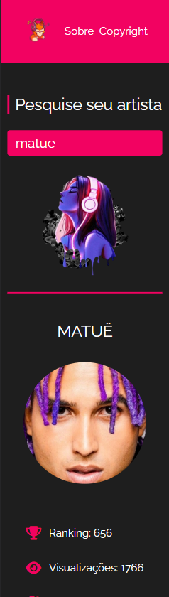
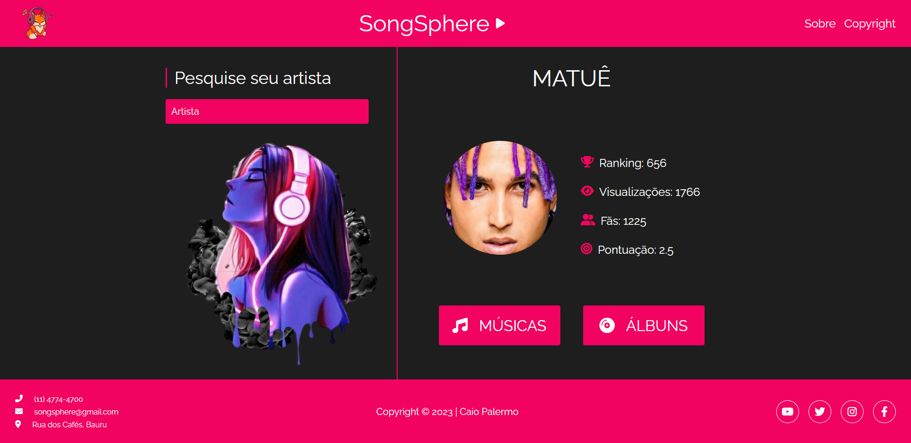

 

<h1><strong>CONSUMO API - SONGSPHERE</strong></h1>

|      MOBILE         |          DESKTOP       |
|:-------------------:|:-----------------------:
|||

[Clique aqui](https://songsphere.netlify.app/) para acessar o site. 

## *Escopo*

O objetivo do projeto é realizar o consumo de uma API Pública. Escolhi a mesma de música. 

- [Link da API](https://api.vagalume.com.br/)

## *Tecnologias Utilizadas*

- HTML
- CSS
- Markdown
- Responsividade
- JavaScript
- Web Components

## *Figma*
Utilizando a ferramenta de design Figma, foi planejado o breakpoint. 
Segue o link: 

- [Link do Figma](https://www.figma.com/file/pPay2kEantOvMZDUahAJ2c/SONGSPHERE?type=design&node-id=0-1&t=6oTegQLaQOgEYXc7-0)

## *Deploy*
A hospedagem do site foi feita no Netlify. Segue o link: 

- [Link do deploy no Netlify](https://songsphere.netlify.app/)

## *Critérios de avaliação*

- [x]  Documentou problemas, se encontrado, para futuras consultas?
- [x]  Foi criado o layout no figma?
- [x]  A página foi construída seguindo o planejado no Figma?
- [x]  A página funciona em dispositivos diferentes?
- [x]  Foi consumida a API escolhida?
- [x]  Foi criado web componentes?
- [ ]  Foi criado um padrão de roteamento para as paginas?
- [x]  As funções foram criadas seguindo à boa prática de responsabilidade única?
- [x]  Quando possível, foi criado funções puras?
- [x]  O projeto está publicado?
- [x]  Foi criado o arquivo README.md?

## *Autor*

| NOME                                                                                                                                                                                      |                                                     GITHUB                                                      |                                       
| :----------------------------------------------------------------------------------------------------------------------------------------------------------------------------------------- | :-------------------------------------------------------------------------------------------------------------: | :------------------------------------------------------------------------------: |
|  |   

## *Problemas Encontrados*
Utilizando-se WebComponents, não se consegue fazer a utilização do fontawesome por conta do shadow root, que encapsula as tags e os estilos. Para resolver isso, segue a documentação:

- [Link do Notion](https://shining-ocelot-f70.notion.site/DOCUMENTA-O-DE-PROBLEMAS-148e7fad12344e69ba5b0df87e741d16)

